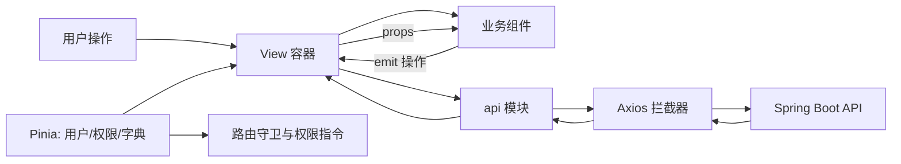

# PMTool 项目管理系统实施文档（Vue 3 + Java 17）

> 版本：v1.0  
> 状态：可实施  
> 技术基线：Vue 3 + TypeScript + Vite、Java 17 + Spring Boot 3.3.x、MySQL 8.0  
> 编写依据：`开发文档.md`（业务、前端、数据库、API）与 `开发文档-Java版.md`（Java 后端架构设计）

---

## 1. 目标与边界

PMTool 是面向企业内部使用的项目管理系统，提供客户、项目、任务、人员和协作管理能力。本项目是全新系统：后端使用 Java 17 实现，前端使用 Vue 3 实现管理后台；不迁移任何存量系统代码、数据或用户账号。

### 1.1 本期范围

| 领域 | 交付能力 |
|---|---|
| 认证与账户 | 登录、退出、当前用户、修改/重置密码 |
| 客户 | 客户 CRUD、联系人、跟进记录 |
| 项目 | 项目 CRUD、成员、里程碑、列表/看板/甘特视图、附件 |
| 任务 | 任务 CRUD、状态流转、拖拽排序、批量操作、依赖、工时预估 |
| 组织与权限 | 用户、部门树、角色、菜单与接口权限 |
| 协作 | 工时申报与审批、站内通知（非实时）、附件上传/下载、项目文档、项目风险、操作日志 |
| 工作台 | 项目/任务统计、趋势、人员负载、最近事项、即将到期里程碑 |

### 1.2 本期不包含

- 移动端原生应用和离线能力；Web 端仅保证常见桌面分辨率可用。
- WebSocket、SSE 等实时通知/即时推送；第一期提供站内通知列表、未读数与已读标记，前端在进入系统及操作后刷新。
- 与第三方 OA、企业微信、钉钉等系统的集成。

### 1.3 文档冲突的统一决策

| 事项 | 统一方案 |
|---|---|
| 后端运行时 | **Java 17**，不使用 Java 21 专属 API；Spring Boot 3.3.x 支持 Java 17。 |
| 存量系统 | 不迁移代码、数据、密码或账号；初始数据仅由本系统种子脚本创建。 |
| API | 基础路径 `/api/v1`，响应统一为 `{ code, message, data }`。 |
| 时间格式 | 请求与响应统一 ISO 8601（例如 `2026-07-24T10:30:00+08:00`）；前端提交空日期时传 `null`，不可传空字符串。 |
| 密码 | 全部新账号使用 BCrypt 哈希；不保留旧哈希算法或兼容分支。 |
| 数据库变更 | 开发环境可使用 Hibernate 校验；所有环境均以 Flyway 迁移脚本为唯一建表和变更方式。 |

---

## 2. 技术架构与工程结构

### 2.1 技术选型

| 层级 | 选型 | 用途 |
|---|---|---|
| 前端 | Vue 3、TypeScript、Vite | 单页应用和工程构建 |
| 前端 UI | Element Plus、ECharts、vuedraggable | 表单表格、图表、项目看板拖拽 |
| 前端基础设施 | Vue Router、Pinia、Axios | 路由鉴权、全局状态、请求封装 |
| 后端 | Java 17、Spring Boot 3.3.x、Spring MVC | REST API |
| 数据访问 | Spring Data JPA、Hibernate、MySQL Connector/J、MapStruct | 实体持久化、查询和 DTO 映射 |
| 安全 | Spring Security、JWT、BCrypt | 无状态认证与授权 |
| 运维 | Flyway、SpringDoc OpenAPI、Actuator、Nginx、systemd | 迁移、接口文档、监控和部署 |
| 数据库 | MySQL 8.0 | 业务数据持久化 |

### 2.2 总体部署图

```text
浏览器
  │ HTTPS
  ▼
Nginx : 8989
  ├─ /            → Vue 3 静态文件
  └─ /api/        → Spring Boot : 5959
                         │ JDBC/HikariCP
                         ▼
                     MySQL 8.0 : 3306（数据库：pmtool_db）
```

### 2.3 推荐仓库结构

```text
project-managment/
├─ frontend/                         # Vue 3 管理后台
│  ├─ src/
│  │  ├─ api/                        # 按领域拆分的请求函数
│  │  ├─ assets/
│  │  ├─ components/                 # 可复用业务/基础组件
│  │  ├─ composables/
│  │  ├─ directives/
│  │  ├─ layouts/
│  │  ├─ router/
│  │  ├─ stores/
│  │  ├─ types/
│  │  ├─ utils/
│  │  └─ views/
│  └─ package.json
├─ backend/                          # Spring Boot 应用
│  ├─ src/main/java/com/pmtool/
│  │  ├─ config/
│  │  ├─ common/                     # 响应、异常、分页、常量
│  │  ├─ security/
│  │  ├─ module/                     # auth/customer/project/task/... 按领域分包
│  │  │  └─ <domain>/{controller,service,repository,entity,dto,mapper}/
│  │  └─ PmToolApplication.java
│  ├─ src/main/resources/
│  │  ├─ db/migration/               # Flyway: V1__init.sql 等
│  │  ├─ application.yml
│  │  ├─ application-dev.yml
│  │  └─ application-prod.yml
│  ├─ src/test/java/
│  └─ pom.xml
├─ deploy/                            # Nginx、systemd、环境变量示例
└─ docs/
```

### 2.4 后端分层规则

`Controller → Service → Repository → MySQL` 是唯一的写入/查询主链路。Controller 只完成请求绑定和响应；Service 负责事务、业务校验和权限上下文；Repository 只负责持久化；Entity 不直接作为接口响应。所有跨层传输使用 DTO，MapStruct 负责实体与 DTO 映射。

`pom.xml` 必须固定 Java 17：

```xml
<properties>
  <java.version>17</java.version>
  <maven.compiler.release>17</maven.compiler.release>
</properties>
```

依赖至少包括：`spring-boot-starter-web`、`spring-boot-starter-data-jpa`、`spring-boot-starter-security`、`spring-boot-starter-validation`、`mysql-connector-j`、`flyway-mysql`、`jjwt`、`mapstruct`、`springdoc-openapi` 与测试依赖。MapStruct 与 Lombok 同时使用时，必须配置 Maven 编译器的 annotation processor。

---

## 3. 业务模块与数据设计

### 3.1 核心实体

| 领域 | 核心实体 | 关键关系 |
|---|---|---|
| 组织 | User、Role、Permission、Department、UserRole、RolePermission | 用户可有多个角色；部门为树结构。 |
| 客户 | Customer、Contact、CustomerFollowUp | 一个客户有多个联系人和跟进记录。 |
| 项目 | Project、ProjectMember、Milestone、ProjectDocument、ProjectRisk | 一个项目有多成员、里程碑、文档和风险。 |
| 任务 | ProjectTask、TaskDependency、WorkLog | 任务属于项目，可指派用户并产生工时；依赖关系须防环。 |
| 协作 | Attachment、Notification、OperationLog | 附件可关联项目或任务；通知归属用户。 |
| 配置 | SystemConfig | 保存系统级配置。 |

### 3.2 通用字段与约束

所有主实体采用 `BIGINT` 主键，并包含：`created_at`、`updated_at`、`created_by`、`updated_by`、`deleted`。删除为软删除，查询统一过滤 `deleted = 0`。

- `username`、角色编码、项目编码、客户编码建立唯一索引。
- 任务列表索引：`(project_id, status, deleted)`、`(assignee_id, status, deleted)`。
- 通知索引：`(user_id, is_read, created_at)`。
- 附件记录保存原始文件名、文件存储相对键、MIME 类型、文件大小、业务类型与业务 ID；文件本体不存入 MySQL。
- 项目、任务与工时表增加 `version` 字段并启用 JPA 乐观锁，避免看板拖拽或并发编辑覆盖。
- 项目总进度按任务的工时预估加权汇总；未设置工时预估的任务按任务数量平均计入。成员只更新自己承担任务的执行进度，不直接写入项目总进度。

### 3.3 业务状态枚举

| 类型 | 可用值 |
|---|---|
| 项目状态 | `planning`、`in_progress`、`paused`、`completed`、`cancelled` |
| 任务状态 | `todo`、`in_progress`、`review`、`done` |
| 优先级 | `low`、`medium`、`high`、`urgent` |
| 工时状态 | `pending`、`approved`、`rejected` |
| 里程碑状态 | `pending`、`in_progress`、`completed`、`overdue` |

状态值使用字符串常量，不将前端展示名称写入数据库。所有状态迁移由 Service 校验，前端只负责提供允许的操作入口。

---

## 4. 后端接口与安全约定

### 4.1 统一约定

```json
{
  "code": 0,
  "message": "ok",
  "data": {}
}
```

| 情况 | HTTP 状态 | `code` | 前端行为 |
|---|---:|---:|---|
| 成功 | 200 / 201 | 0 | 处理 `data` |
| 参数不合法 | 400 | 40001 | 展示字段错误 |
| 未认证 | 401 | 40100 | 清除会话并跳转登录 |
| 无权限 | 403 | 40300 | 展示无权限页面或提示 |
| 资源不存在 | 404 | 40400 | 展示空/不存在状态 |
| 业务冲突 | 409 | 40900 | 提示刷新或更正操作 |
| 系统错误 | 500 | 50000 | 记录 traceId，展示通用错误 |

分页请求统一为 `page`（从 1 开始）和 `pageSize`，响应为：

```json
{ "items": [], "total": 0, "page": 1, "pageSize": 20 }
```

### 4.2 接口清单

| 模块 | 路径前缀 | 主要接口 |
|---|---|---|
| 认证 | `/auth` | `POST /login`、`GET /info`、`POST /change-password` |
| 客户 | `/customers` | CRUD、`/{id}/contacts`、`/{id}/follow-ups` |
| 项目 | `/projects` | CRUD、`/{id}/members`、`/{id}/milestones`、`/{id}/board` |
| 任务 | `/tasks` | CRUD、`/{id}/status`、`/reorder`、`/batch-status`、`/project/{id}/gantt` |
| 附件 | `/attachments` | `/{targetType}/{targetId}` 列表/上传、`/{id}/download`、删除 |
| 用户与组织 | `/users`、`/departments`、`/roles` | 用户 CRUD、部门树、角色管理与授权 |
| 协作 | `/work-logs`、`/notifications` | 工时 CRUD/审批、通知列表/已读 |
| 工作台 | `/dashboard` | 聚合统计、趋势、负载和近期事项 |

完整地址为 `/api/v1` 加上表中路径。对“状态更新”“重排序”“审批”等非 CRUD 操作使用明确动作端点；重排序请求须携带任务 ID 顺序和各任务版本号，发生版本冲突时返回 409。

### 4.3 认证与权限

1. 登录成功后返回短时 JWT（建议 30 分钟）与可选刷新令牌；生产环境的密钥仅从环境变量读取。
2. Axios 请求拦截器追加 `Authorization: Bearer <token>`；后端 JWT Filter 验签、解析用户 ID 与角色。
3. 路由元信息声明所需权限，例如 `meta: { permissions: ['project:read'] }`；路由守卫在进入页面前校验。
4. 权限范围统一如下：管理员拥有全局管理权；项目经理可创建并管理自己负责的项目及其成员、任务、里程碑、风险和文档；成员仅能访问已加入的项目，并更新自己承担的任务/执行进度。项目总进度由任务进度自动汇总，管理员和项目经理可在必要时进行人工校正并记录原因。
5. 前端 `v-permission` 指令仅用于隐藏/禁用入口，**不能替代后端授权**。
6. 后端在 Controller 或 Service 上以 `@PreAuthorize` 进行资源级授权，并在 Service 中校验当前用户与项目的成员关系及数据范围。
7. 所有修改型接口记录操作者、时间和 traceId，并在第一期写入 OperationLog；操作日志只读，不向普通成员暴露管理查询入口。记录登录、创建、修改、删除、审批事件，默认保留 180 天，由定时任务清理过期数据。

### 4.4 附件安全

- 文件类型不设业务白名单，但单文件大小严格限制为 **2 MB**；服务端根据实际文件流识别 MIME 类型并记录审计信息。
- 服务端生成文件存储相对键，禁止直接使用用户提供的文件名或路径；上传接口预留病毒扫描/恶意文件检测的异步钩子。
- 下载前校验目标资源读取权限，统一使用短期签名 URL 或经后端转发；响应设置 `Content-Disposition: attachment`，避免浏览器直接执行活跃内容。
- 附件保存至服务器私有目录，目录由 `FILE_STORAGE_DIR` 环境变量指定；下载一律经后端鉴权转发，不作为 Nginx 静态目录公开。目录权限、磁盘空间与备份由服务器运维负责。

---

## 5. 前端架构设计

### 5.1 视觉与适配基线

- 主色为 `#009982`，用于主按钮、选中菜单、重点状态和图表主序列；在 Element Plus 中通过 CSS 变量统一覆盖，不在业务组件中散落色值。
- 第一版以桌面管理后台为基线（建议最小内容宽度 1200px），不承诺移动端响应式适配；小屏设备显示最小宽度并允许横向滚动。
- 当前没有设计稿。页面优先采用 Element Plus 的一致性布局、清晰层级和可访问表单反馈；后续设计稿只影响样式与组件外观，不改变接口和领域模型。

### 5.2 页面与路由

| 路由 | 页面 | 权限 |
|---|---|---|
| `/login` | 登录 | 匿名 |
| `/dashboard` | 工作台 | `dashboard:read` |
| `/customers` | 客户列表与编辑 | `customer:read` / `customer:write` |
| `/projects` | 项目列表 | `project:read` |
| `/projects/:id` | 项目详情（概览、看板、甘特、成员、里程碑、附件） | `project:read` |
| `/tasks` | 全局任务列表 | `task:read` |
| `/users`、`/departments`、`/roles` | 组织与权限管理 | `system:manage` |
| `/work-logs` | 工时申报与审批 | `worklog:read` / `worklog:approve` |
| `/notifications` | 通知中心（非实时） | 已登录 |
| `/profile` | 个人中心 | 已登录 |

### 5.3 组件树拆分指南

```text
App
├─ AuthLayout
│  └─ LoginView
└─ MainLayout
   ├─ AppSidebar
   ├─ AppHeader
   │  ├─ Breadcrumb
   │  └─ NotificationBell
   └─ RouterView
      ├─ DashboardView
      │  ├─ StatCards
      │  ├─ TrendChart
      │  ├─ StatusChart
      │  ├─ MemberWorkloadTable
      │  └─ RecentItems
      ├─ CustomerListView
      │  ├─ QueryToolbar
      │  ├─ CustomerTable
      │  └─ CustomerFormDialog
      ├─ ProjectListView
      │  ├─ ProjectFilter
      │  ├─ ProjectTable
      │  └─ ProjectFormDialog
      └─ ProjectDetailView
         ├─ ProjectSummary
         ├─ ProjectTabs
         │  ├─ ProjectBoard
         │  │  └─ TaskColumn → TaskCard
         │  ├─ ProjectGantt
         │  ├─ MilestonePanel
         │  ├─ MemberPanel
         │  └─ AttachmentPanel
         └─ TaskDrawer
```

页面容器负责请求、路由参数与局部状态；展示组件只通过 `props` 接收数据并以 `emit` 抛出用户操作。表格查询区、分页、状态标签、人员选择、附件上传和确认删除弹窗需沉淀为可复用组件或 composable。

### 5.4 核心状态管理层分布

| 状态 | 层级/存储 | 说明 |
|---|---|---|
| token、当前用户、权限 | `authStore`（Pinia） | 登录后初始化；刷新页面从安全存储恢复并校验。 |
| 字典、角色、用户简表 | `appStore`（Pinia） | 按需加载并设置失效时间。 |
| 未读通知数 | `notificationStore`（Pinia） | 登录、进入通知页及相关操作后刷新；第一期不建立 WebSocket 连接。 |
| 项目详情与当前视图 | 项目详情页面 composable | 离开页面即释放，避免全局状态膨胀。 |
| 列表筛选、页码、弹窗、表单 | 页面局部 `ref/reactive` | 与 URL query 同步的筛选条件例外。 |
| 表单校验与提交状态 | 表单组件局部状态 | 提交期间锁定按钮，禁止重复写入。 |

### 5.5 数据流向全景图



### 5.6 加载、异常与降级

- 表格首次加载使用区域骨架屏；翻页、筛选使用表格 `loading` 遮罩。
- 表单提交、批量操作和文件上传使用按钮级 loading，并在请求完成前禁用重复提交。
- Axios 统一处理 401、403 和未知 5xx；业务校验错误由页面显示字段提示。
- Dashboard、甘特图等聚合区块请求失败时保留其他可用区块，并展示可重试的局部错误面板。
- 路由懒加载失败、网络中断和空数据均应提供明确提示，禁止仅输出控制台异常。
- 对任务指派、任务状态变化、里程碑临期、工时审批和工时驳回创建站内通知；通知接收人依据任务负责人、项目成员和工时提交人确定。

---

## 6. 开发顺序与验收标准

### 6.1 实施阶段

| 阶段 | 后端交付 | 前端交付 | 完成条件 |
|---|---|---|---|
| 0. 基础工程 | Spring Boot、Flyway、统一响应/异常、Security、OpenAPI、测试基架 | Vue 工程、布局、路由、Axios、Pinia、权限指令 | 本地前后端可启动，登录页可访问。 |
| 1. 认证与组织 | 登录、BCrypt 密码、用户、部门、角色、权限与操作日志 | 登录、个人中心、用户/部门/角色页面 | 不同角色进入系统只见有权菜单，接口越权返回 403。 |
| 2. 客户与项目 | 客户、联系人、项目、成员、里程碑、风险与项目文档 | 客户和项目 CRUD、项目详情基础页 | 项目可关联客户/成员，数据持久化且可分页查询。 |
| 3. 任务协作 | 任务、依赖、排序、本地私有附件、非实时通知 | 任务列表、看板拖拽、详情抽屉、附件与通知面板 | 拖拽更新状态/顺序，冲突可识别，附件单文件不超过 2 MB 且受权限保护。 |
| 4. 工时与工作台 | 工时审批、Dashboard 聚合接口 | 工时页面、统计卡片和图表 | 统计口径与列表数据可追溯一致。 |
| 5. 上线准备 | 监控、审计、备份、性能与安全测试 | 响应式修整、错误页、端到端回归 | 通过部署演练和核心流程验收。 |

### 6.2 核心验收用例

1. 管理员创建项目、添加成员、创建里程碑和任务；成员只能查看已加入项目。
2. 成员将任务从“待办”拖至“进行中”，刷新后状态和排序保持一致。
3. 两位用户同时修改同一任务时，后一提交得到 409 提示并可刷新重试。
4. 工时只能由本人提交；项目经理或管理员才能审批；驳回后可重新提交。已审批工时仅管理员或项目经理可修改，修改后自动重置为待审批并留下操作日志。
5. 任务有工时、附件或依赖关系时只允许软删除，并向操作者提示关联影响；系统不物理删除业务任务数据。
6. 删除项目、任务、客户为软删除，普通列表不可见但数据库审计字段完整。
7. 无 Token、过期 Token、错误权限、非法附件和非法日期都得到预期错误响应。
8. 登录、客户 CRUD、项目 CRUD、看板、甘特、附件、通知和工作台在部署环境完整回归。

### 6.3 测试策略

| 层级 | 工具/方法 | 覆盖重点 |
|---|---|---|
| 后端单元测试 | JUnit 5、Mockito | 状态迁移、进度计算、权限判断、密码升级。 |
| 后端集成测试 | Spring Boot Test、Testcontainers（建议） | MySQL/Flyway/JPA 查询、JWT、Controller 响应。 |
| 前端单元测试 | Vitest | composable、store、格式化与权限指令。 |
| 前端组件测试 | Vue Test Utils | 表单校验、表格操作、权限隐藏。 |
| E2E | Playwright | 登录到项目/任务/工时的关键闭环。 |

---

## 7. 配置、部署与运维

### 7.1 环境配置原则

- `application.yml` 只放非敏感默认项；数据库密码、JWT 密钥和附件存储目录通过环境变量或受管配置注入。数据库名称为 `pmtool_db`。首个管理员的账号和初始密码也仅从环境变量读取。
- `application-dev.yml` 使用本地数据库；`application-prod.yml` 使用生产连接池、日志级别和 CORS 白名单。
- `spring.jpa.hibernate.ddl-auto=validate`；Flyway 在应用启动前执行迁移。
- 前端开发服务器和生产 Nginx 均使用端口 `8989`；后端使用端口 `5959`。开发环境允许 Vite 地址跨域；生产环境由 Nginx 同域反代 `/api`，无需宽泛 CORS。

### 7.2 构建与启动

```bash
# 后端：在 backend/ 中执行
mvn clean verify
java -jar target/pmtool-*.jar --spring.profiles.active=prod --server.port=5959

# 前端：在 frontend/ 中执行
npm ci
npm run build
```

Java 与服务器运行时必须为 17。Nginx 监听 `8989`，将 `/api/` 转发到 `127.0.0.1:5959`，前端构建产物部署到其静态目录。systemd 服务使用非 root 账号运行，并在 `EnvironmentFile` 中读取敏感变量。

### 7.3 上线检查清单

- [ ] 生产库已完成备份，Flyway 迁移在预发布环境验证。
- [ ] JWT 密钥、数据库密码和管理员初始密码未写入仓库。
- [ ] Nginx 已配置 HTTPS、上传大小和超时限制。
- [ ] `/actuator/health` 已接入监控，日志含 traceId 且不记录密码或 Token。
- [ ] 私有附件目录、访问权限和备份策略已配置；附件仅能通过后端鉴权下载。
- [ ] 开发环境可创建种子管理员；生产首个管理员仅由环境变量创建，账号和初始密码不写入仓库。
- [ ] 关键业务流完成 E2E 回归，接口文档由 SpringDoc 自动发布。

---

## 8. 风险与优先处理项

| 优先级 | 风险 | 处理方式 |
|---|---|---|
| 高 | 权限边界不清会导致项目数据越权 | 阶段 1 完成管理员、项目经理、成员的菜单、接口与数据级三层授权后再开发业务模块。 |
| 高 | 成员直接修改项目总进度会与任务汇总冲突 | 成员更新任务/执行进度，项目总进度自动汇总；人工校正仅限管理员、项目经理且记录原因。 |
| 高 | 使用 `ddl-auto=update` 可能导致生产库不可控 | 用 Flyway 管理所有 DDL，启动时仅 validate。 |
| 中 | 日期格式不一致导致前端解析不稳定 | 统一 ISO 8601，契约测试覆盖 `null` 日期。 |
| 中 | 看板拖拽和任务编辑并发覆盖 | 乐观锁与 409 冲突响应；前端提供刷新重试。 |
| 中 | Dashboard 聚合查询数据量增长 | 首先建立索引；必要时对统计结果短时缓存。 |
| 中 | 不限文件类型可能引入恶意文件 | 强制 2 MB 上限、随机对象键、鉴权下载、附件形式下载及病毒扫描钩子。 |

---

## 9. 已确认的项目决策

| 决策项 | 已确认内容 |
|---|---|
| 数据迁移 | 全新项目，不迁移任何旧系统数据、账号或密码。 |
| 角色权限 | 管理员全局最高权限；项目经理可新增和管理所负责项目；成员可更新已参与项目中的任务/执行进度。 |
| 项目进度 | 按任务工时预估加权汇总；无预估时按任务数量平均；成员仅更新自己任务的执行进度。 |
| 工时审批 | 管理员和项目经理审批；驳回后可重新提交；已审批记录仅管理员/项目经理可修改，修改后重置待审批并记录日志。 |
| 附件 | 服务器本地私有目录；后端鉴权下载；文件类型不限；单文件不超过 2 MB。 |
| 第一版范围 | 项目风险、项目文档、操作日志均纳入；实时通知不纳入。 |
| 部署 | 通用 Linux + Nginx + systemd；前端端口 `8989`，后端端口 `5959`，数据库 `pmtool_db`。 |
| 视觉和适配 | 无设计稿；主色 `#009982`；第一版不做移动端响应式适配。 |
| 通知 | 对任务指派/状态变化、里程碑临期、工时审批/驳回生成站内通知；不使用实时推送。 |
| 删除与审计 | 有工时、附件或依赖的任务只允许软删除；记录登录、增删改和审批日志，默认保留 180 天。 |
| 初始管理员 | 开发可用种子账号；生产账号和初始密码由环境变量创建。 |

本文件已具备开工条件，可从“阶段 0：基础工程”开始执行。接口细节以 SpringDoc 自动生成的 OpenAPI 文档为准；任何接口或数据字段变更须同步更新 DTO、前端 TypeScript 类型、Flyway 脚本和测试用例。
